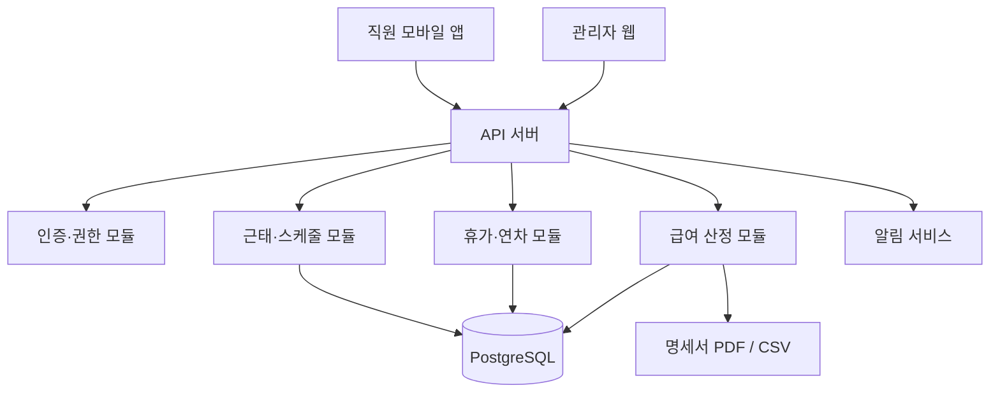

# TimeFit 1차 기획서

> 문서 버전: v0.1 · 작성일: 2026-08-09

## 1. 제품 정의

TimeFit은 소규모 사업장과 매장이 직원의 출퇴근, 근무 스케줄, 휴가·연차, 급여 정보를 한 곳에서 관리하도록 돕는 근태·인사 관리 서비스다. 직원은 모바일에서 기록하고, 관리자는 웹에서 승인·정산·현황 확인을 한다.

### 목표

- 수기 근태표와 메신저 기반 휴가 요청을 디지털 업무 흐름으로 전환한다.
- 실제 근무기록을 급여 산정의 근거 데이터로 연결한다.
- 관리자와 직원 모두가 일정, 연차 잔여일, 급여 결과를 투명하게 확인하게 한다.

### 비목표 (MVP 제외)

- 국세·4대보험 신고 대행
- 회계 시스템 전체 기능
- 복잡한 다법인·다국가 급여 규정 자동 처리

## 2. 사용자 및 권한

| 역할 | 주요 업무 | 권한 |
|---|---|---|
| 사업주/관리자 | 정책 설정, 급여 마감, 전체 현황 확인 | 전체 조회·생성·수정·승인 |
| 매니저 | 담당 근무지의 일정·근태 관리 | 담당 직원 조회, 스케줄 작성, 요청 승인 |
| 직원 | 출퇴근, 일정·급여 확인, 휴가 신청 | 본인 정보 및 기록 조회, 신청 |

## 3. 핵심 사용자 흐름

1. 관리자가 사업장, 근무지, 직원, 고용형태 및 급여 기준을 등록한다.
2. 관리자가 직원별 근무 스케줄을 배정한다.
3. 직원이 출근·퇴근을 기록하고, 시스템이 실제 근무시간을 계산한다.
4. 직원이 휴가·휴무·출퇴근 수정 요청을 제출하고 관리자가 승인한다.
5. 월 마감 시 승인된 근태와 휴가 데이터를 기준으로 급여 초안을 생성한다.
6. 관리자가 수당·공제 항목을 검토한 뒤 급여를 확정하고 명세서를 공개한다.

## 4. MVP 기능 요구사항

### 4.1 직원·조직

- 직원 기본정보: 이름, 연락처, 입사일, 소속, 직책, 재직 상태
- 고용형태: 시급제, 월급제, 일급제
- 급여 기준: 시급 또는 월 기본급, 기본 휴게시간, 수당 항목
- 사업장/근무지 단위의 직원 배정

### 4.2 출퇴근

- 직원의 출근·퇴근 기록 생성
- 예정 스케줄과 실제 시각을 비교해 지각·조퇴·결근 후보 표시
- 휴게시간 및 일별 실근무시간 계산
- 누락 또는 오류 기록의 수정 요청과 승인 흐름
- 관리자 월별 근태 조회 및 CSV 다운로드

### 4.3 스케줄

- 월/주 단위 캘린더
- 근무 유형(오픈, 마감, 오전, 오후, 야간, 휴무) 템플릿
- 직원별 근무 배정 및 반복 일정
- 스케줄 변경 이력과 직원 알림

### 4.4 휴가·연차

- 연차, 반차, 시간휴가, 병가, 경조휴가 등 유형 설정
- 신청 → 승인/반려 → 스케줄 반영 → 잔여일 갱신
- 입사일 기준 또는 회계연도 기준의 연차 정책 선택
- 연차 발생·사용·잔여 내역 조회

### 4.5 급여

- 시급제: 승인된 근무시간 × 시급 기반의 급여 초안
- 월급제: 기본급, 수당, 공제 항목을 포함한 급여 초안
- 연장·야간·휴일 근무시간을 별도 집계할 수 있는 데이터 구조
- 급여 마감, 명세서 상태 관리, PDF/CSV 내보내기

> 노동시간, 휴게, 휴일 및 가산수당의 계산 기준은 사업장 규정 및 적용 법령에 따라 달라질 수 있다. MVP에서는 `급여 정책`을 사업장별 설정값으로 두며, 실제 지급 전 관리자의 최종 검토를 필수로 한다.

## 5. 화면 설계

| 화면 | 대상 | 핵심 정보/행동 |
|---|---|---|
| 관리자 대시보드 | 관리자 | 오늘 출근·미출근, 승인 대기, 주간 스케줄 |
| 직원 관리 | 관리자 | 직원 등록, 고용형태·급여 기준 편집 |
| 출퇴근 현황 | 관리자/직원 | 일·월별 기록, 상태 확인, 수정 요청 |
| 스케줄 캘린더 | 관리자/직원 | 배정, 변경, 일정 확인 |
| 휴가·연차 | 관리자/직원 | 신청, 승인, 잔여일·이력 확인 |
| 급여 관리 | 관리자/직원 | 월별 산정, 마감, 명세서 확인 |

## 6. 정보 구조 및 데이터 모델

```text
Organization
 ├─ Workplace
 ├─ Employee
 │   ├─ EmploymentContract
 │   ├─ Schedule
 │   ├─ AttendanceRecord
 │   ├─ LeaveRequest
 │   └─ LeaveBalance
 ├─ WorkPolicy
 ├─ LeavePolicy
 └─ PayrollRun
     └─ PayrollItem
```

| 엔터티 | 핵심 필드 |
|---|---|
| Employee | id, 이름, 입사일, 상태, 근무지, 역할 |
| EmploymentContract | 고용형태, 시급/월급, 계약 시작·종료일 |
| Schedule | 직원, 근무일, 예정 시작·종료, 근무유형 |
| AttendanceRecord | 실제 출근·퇴근, 휴게시간, 승인상태, 수정사유 |
| LeaveRequest | 유형, 기간/시간, 상태, 승인자 |
| LeaveBalance | 기준연도, 발생, 사용, 잔여 |
| PayrollRun | 대상월, 상태, 마감일 |
| PayrollItem | 직원, 기본급, 수당, 공제, 실지급액 |

## 7. 시스템 아키텍처



### 권장 기술 스택

- 관리자 웹: React + Vite (1차 골격 적용)
- 직원 앱: React Native 또는 Flutter
- API: NestJS 또는 FastAPI
- 데이터베이스: PostgreSQL
- 인증: JWT 기반 세션, 역할 기반 접근 제어(RBAC)
- 파일/알림: 객체 스토리지, Firebase Push, 알림톡 연동

## 8. 개발 우선순위

| 단계 | 범위 | 완료 기준 |
|---|---|---|
| 1차 | 관리자 웹 UI, 직원·스케줄·근태 목업 | 핵심 화면과 정보 구조 검증 |
| 2차 | 인증, 직원/스케줄/출퇴근 CRUD API | 실제 근태 기록 저장 가능 |
| 3차 | 휴가 승인, 연차 잔여 계산 | 휴가 흐름 자동 반영 |
| 4차 | 급여 산정·마감·명세서 | 월별 정산 업무 지원 |

## 9. 성공 지표

- 주간 활성 사업장 수
- 출퇴근 기록의 당일 완료율
- 휴가 요청의 평균 승인 소요시간
- 월 급여 마감에 걸리는 시간
- 수기/엑셀 대비 급여 수정 요청 건수

## 10. 다음 결정 사항

1. 초기 타깃 업종(카페·외식·소매 등)과 사업장 규모를 확정한다.
2. 출퇴근 인증 방식(단순 버튼, GPS, QR, 비콘)을 결정한다.
3. 연차 및 수당 계산에 적용할 사업장 정책을 정의한다.
4. 직원용 앱을 웹 기반으로 시작할지, 네이티브 앱으로 제공할지 결정한다.
