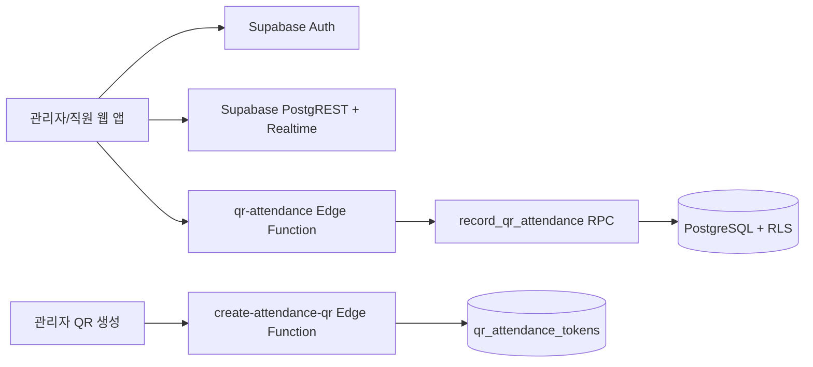

# Supabase 백엔드 및 QR 출퇴근 설계

## 1. 아키텍처



## 2. 스키마 범위

마이그레이션 파일 `supabase/migrations/20260809000100_timefit_core.sql`은 다음을 생성한다.

- Auth 연동: `profiles`, `organization_members`
- 운영: `organizations`, `workplaces`, `employees`, `employment_contracts`
- 근태: `work_schedules`, `attendance_records`, `qr_attendance_tokens`
- 휴가: `leave_policies`, `leave_balances`, `leave_requests`
- 급여: `payroll_runs`, `payroll_items`
- 감사: `approval_logs`

각 업무 테이블에 RLS를 적용했다. 직원은 본인 데이터만, 관리자·매니저는 소속 조직 데이터를, 소유자·관리자는 급여·정책을 관리한다.

## 3. QR API 계약

### QR 생성: `create-attendance-qr`

관리자/매니저만 호출한다.

```json
POST /functions/v1/create-attendance-qr
{
  "organizationId": "uuid",
  "workplaceId": "uuid",
  "workDate": "2026-08-09",
  "expiresAt": "2026-08-09T09:15:00+09:00"
}
```

응답의 `token`만 QR 이미지로 만들며 DB에는 SHA-256 해시만 저장한다. QR에는 민감한 직원 정보나 service role key를 넣지 않는다.

### QR 출퇴근: `qr-attendance`

인증된 직원만 호출한다.

```json
POST /functions/v1/qr-attendance
Authorization: Bearer <user-access-token>

{
  "token": "raw-qr-token",
  "action": "check_in",
  "latitude": 37.5445,
  "longitude": 127.0557
}
```

응답은 생성·갱신된 `attendance_records`다. DB RPC는 토큰 만료, 근무일, 조직, 근무지, 중복 출퇴근 상태를 검증한다.

## 4. QR 보안 원칙

- 토큰은 256비트 난수이며 DB에는 해시만 저장한다.
- 토큰은 근무지·근무일·만료 시각에 묶인다.
- 같은 출근/퇴근 상태를 두 번 기록할 수 없다.
- 위치는 사용자 동의가 있을 때만 전송하고, 미동의여도 QR 정책이 허용하면 출퇴근은 가능하도록 설계한다.
- 프로덕션에서는 QR을 5~15분 단위로 재발급하거나 매장 디스플레이에 시간 제한 QR을 표시한다.
- Edge Function에는 anon key만 사용하며 service role key는 클라이언트에 절대 노출하지 않는다.

## 5. 적용 절차

1. `supabase login`으로 CLI를 인증한다.
2. `supabase link --project-ref <project-ref>`로 프로젝트를 연결한다.
3. `supabase db push`로 마이그레이션을 적용한다.
4. `supabase functions deploy qr-attendance` 및 `create-attendance-qr`을 배포한다.
5. Vercel 환경 변수 `VITE_SUPABASE_URL`, `VITE_SUPABASE_ANON_KEY`를 설정한다.
6. Supabase Auth 로그인 후 현재 테스트 모드 전환을 실제 역할 기반 접근 제어로 대체한다.

프론트의 QR 스캐너는 `VITE_SUPABASE_URL`과 `VITE_SUPABASE_ANON_KEY`가 설정되면 인식한 원본 토큰을 `qr-attendance` Edge Function으로 전송한다. 환경 변수가 없는 현재 데모 배포에서는 기존 테스트용 상태 전환만 수행한다.

## 6. 현재 제한

원격 Supabase CLI 토큰과 프로젝트 참조값이 아직 연결되지 않아 이 저장소에서는 로컬 구조·마이그레이션·함수 생성까지만 완료했다. 원격 DB 적용과 함수 배포는 프로젝트 연결 후 실행한다.
