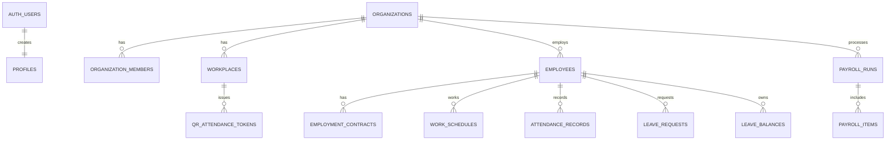

# TimeFit 백엔드·DB 스펙 — Supabase

> 상태: 1차 확정 · 기준일: 2026-08-10

## 1. 기술 결정

TimeFit의 정식 백엔드 및 데이터베이스는 **Supabase**를 사용한다.

| 구분 | 확정 스펙 | 역할 |
|---|---|---|
| 데이터베이스 | Supabase PostgreSQL | 조직·직원·스케줄·근태·휴가·급여 데이터 저장 |
| 인증 | Supabase Auth | 이메일/비밀번호, 향후 소셜·휴대폰 인증 |
| 권한 | PostgreSQL RLS | 직원 본인 데이터, 관리자 조직 데이터 범위 제한 |
| 서버 기능 | Supabase Edge Functions | QR 출퇴근, QR 발급, 급여 마감 등 권한이 필요한 업무 |
| 실시간 반영 | Supabase Realtime | 휴가 승인, 스케줄 변경, 출퇴근 현황 갱신 |
| 프론트 연동 | `@supabase/supabase-js` | Vercel 웹 앱에서 Auth·DB·Function 호출 |

기존 `backend/`의 Express + Prisma 구조는 초기 설계 참고용이며, 운영 DB 접근은 Supabase로 통일한다. 신규 기능은 Prisma 모델이나 Express API가 아닌 Supabase 마이그레이션·RLS·Edge Function에 추가한다.

## 2. 데이터베이스 도메인



### 필수 테이블

| 영역 | 테이블 | 핵심 책임 |
|---|---|---|
| 사용자/조직 | `profiles`, `organizations`, `organization_members`, `workplaces` | 계정, 사업장, 역할, 근무지 |
| 인사 | `employees`, `employment_contracts` | 직원 정보, 고용·급여 기준 |
| 근태 | `work_schedules`, `attendance_records`, `qr_attendance_tokens` | 예정 일정, 실제 출퇴근, QR 검증 |
| 휴가 | `leave_policies`, `leave_balances`, `leave_requests` | 정책, 발생·사용량, 승인 요청 |
| 급여 | `payroll_runs`, `payroll_items` | 월 정산과 직원별 지급 항목 |
| 감사 | `approval_logs` | 승인·반려·마감 이력 |

실제 SQL은 [Supabase 마이그레이션](/Users/marko/Documents/ChatGPT/time_fit/supabase/migrations/20260809000100_timefit_core.sql)에 정의한다.

## 3. 역할과 권한

| 역할 | DB 권한 범위 |
|---|---|
| Owner | 사업장·관리자·급여 정책·급여 마감 전체 관리 |
| Admin | 직원, 스케줄, 휴가, 급여 관리 |
| Manager | 담당 사업장 직원·스케줄·근태·휴가 승인 |
| Employee | 본인 스케줄·근태·휴가·공개 급여 조회 및 요청 |

권한은 프론트 화면 숨김에 의존하지 않고 RLS에서 최종 강제한다. 모든 조직 데이터에는 `organization_id`를 포함하고, 로그인 사용자의 `organization_members` 행으로 접근을 판정한다.

## 4. API 방침

### Supabase 자동 API

일반 조회 및 CRUD는 RLS가 적용된 PostgREST API를 사용한다.

- 직원의 내 스케줄, 내 휴가, 내 출퇴근 기록 조회
- 관리자의 직원·스케줄·휴가 요청 조회
- 관리자 스케줄 생성·수정
- 직원 휴가 요청 생성

### Edge Function / RPC

트랜잭션·민감한 권한·토큰 검증이 필요한 작업은 Function 또는 RPC로 제한한다.

| 기능 | 진입점 | 검증 |
|---|---|---|
| QR 출퇴근 | `qr-attendance` → `record_qr_attendance` | 로그인, 토큰 해시, 만료, 근무지, 중복 기록 |
| QR 발급 | `create-attendance-qr` | 관리자 역할, 근무지, 유효 기간 |
| 사업장 생성 | `bootstrap_organization` RPC | 로그인 사용자, Owner 멤버십 생성 |
| 휴가 승인 | `approve_leave_request` 예정 RPC | 관리자 권한, 잔여 연차 트랜잭션 |
| 급여 마감 | `close_payroll_run` 예정 RPC | Owner/Admin, 마감 불변성 |

## 5. 환경 변수

Vercel과 로컬 프론트에 아래 공개 키만 설정한다.

```bash
VITE_SUPABASE_URL=https://<project-ref>.supabase.co
VITE_SUPABASE_ANON_KEY=<anon-key>
```

- `service_role` 키는 Edge Function 또는 안전한 서버 환경에만 저장한다.
- 브라우저 코드와 Git 저장소에는 프로젝트 비밀값을 저장하지 않는다.

## 6. 배포 절차

```bash
supabase login
supabase link --project-ref <project-ref>
supabase db push
supabase functions deploy qr-attendance
supabase functions deploy create-attendance-qr
```

그 뒤 Vercel의 환경 변수에 URL과 anon key를 추가하고 재배포한다.

## 7. 전환 상태

| 항목 | 상태 |
|---|---|
| Supabase 로컬 구성 | 완료 |
| PostgreSQL 마이그레이션/RLS | 완료 |
| QR Edge Functions | 완료 |
| 프론트 Supabase 클라이언트 | 완료 |
| 원격 Supabase 프로젝트 연결 | 대기: CLI 인증 및 project ref 필요 |
| 원격 마이그레이션 적용 | 대기 |
| Vercel 환경 변수 연결 | 대기 |
| 기존 프론트 목업 데이터 교체 | 대기 |
