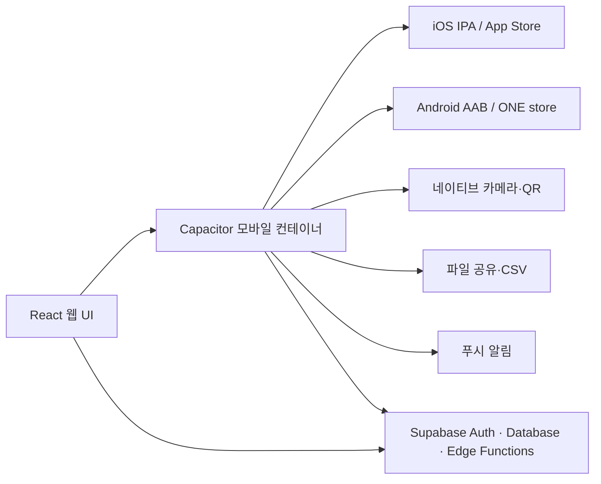

# TimeFit 앱스토어·원스토어 출시 준비 기획

- 작성일: 2026-08-10
- 대상: TimeFit 근태·스케줄 관리 웹앱
- 목표: iOS App Store 및 Android ONE store 심사·배포가 가능한 모바일 앱 패키지와 최종 검증 체계 구축

## 1. 배포 전략

현재 TimeFit은 Vite React 웹앱입니다. 단순 WebView 래퍼는 iOS 심사의 최소 기능성 기준에 부딪힐 가능성이 있으므로, 기존 웹 UI를 재사용하면서 네이티브 기능을 더하는 **Capacitor 기반 하이브리드 앱**으로 전환합니다.

### 채택 범위

| 영역 | 선택 | 이유 |
| --- | --- | --- |
| 앱 컨테이너 | Capacitor | 현재 React 코드와 Vercel 웹 버전을 최대한 재사용 |
| iOS | Capacitor iOS + Xcode | App Store용 IPA/Archive 생성 |
| Android | Capacitor Android + Android Studio | ONE store용 서명 AAB 생성 |
| QR | 네이티브 바코드/카메라 플러그인 우선, 웹 `BarcodeDetector`는 보조 | 실기기 카메라 안정성 및 심사상 네이티브 유용성 확보 |
| CSV | 앱 내 생성 후 네이티브 공유 시트/파일 저장 | 브라우저 다운로드 제한 해소 |
| 알림 | 휴가 승인·근무 전 알림용 FCM/APNs | 앱다운 고유 기능 및 운영 가치 확보 |

## 2. 출시 전 선행 조건

**P0 — 먼저 완료해야 할 조건**

1. 스케줄·휴가 신청/승인·급여·직원·근태 데이터를 Supabase CRUD로 연결한다.
2. 조직/직원 단위 RLS를 적용하고 다른 계정·기기에서 즉시 같은 결과가 보이는지 검증한다.
3. 실제 QR 토큰 발급 관리자 기능, QR 스캔, 출근/퇴근 저장, 만료/중복/타 사업장 실패 처리를 완성한다.
4. 개인정보처리방침, 서비스 이용약관, 계정 탈퇴 및 개인정보 삭제 흐름을 웹·앱에 제공한다.

현재 `localStorage` 기반의 MVP 상태로는 스토어 심사 제출용 운영 앱을 만들지 않습니다. 이 조건을 충족한 뒤 패키징 단계로 이동합니다.

## 3. 모바일 앱 구현 범위

### 3.1 공통

- 앱 ID: `com.timefit.app` (최종 확정 전 Apple/ONE store에서 중복 확인)
- 표시 이름: `타임핏` / 영문 `TimeFit`
- 최소 지원: iOS 15+, Android 9+를 기준으로 기기 호환성 검토
- 환경 분리: `development`, `staging`, `production` Supabase/Vercel 환경값 분리
- 로그인 유지, 세션 만료, 네트워크 오류/재시도, 앱 재실행 복구
- 접근성: 글자 확대, 스크린리더 라벨, 최소 터치 영역 44pt/48dp

### 3.2 iOS App Store 전용 준비

- `NSCameraUsageDescription`: QR 출퇴근을 위한 카메라 사용 목적을 한국어로 명시
- 필요 시 `NSPhotoLibraryAddUsageDescription`: CSV를 사진이 아닌 파일 공유로 처리할 경우에는 불필요할 수 있음
- 앱 아이콘, 런치 화면, iPhone 스크린샷, iPad 지원 여부 확정
- App Store Connect 메타데이터: 카테고리(비즈니스), 연령 등급, 지원 URL, 개인정보처리방침 URL, 심사용 관리자/직원 데모 계정, 심사 노트
- Privacy Nutrition Label: 이메일, 사용자 식별자, 근무/출퇴근 정보, 위치 정보(실제로 수집하는 경우), 카메라 사용 목적을 실제 구현과 일치하게 신고
- `PrivacyInfo.xcprivacy` 및 사용 SDK의 privacy manifest 검사
- TestFlight 내부 테스트 → 외부 테스트 → App Review 순서

Apple은 로그인 앱에 심사 계정과 작동하는 백엔드를 요구하며, 단순 웹사이트 재포장은 최소 기능성 기준에 맞지 않을 수 있습니다. 앱 내 QR 스캔·파일 공유·알림·오프라인 오류 안내를 제공해 이를 충족합니다. [App Review Guidelines](https://developer.apple.com/app-store/review/guidelines/), [App Privacy 안내](https://developer.apple.com/app-store/app-privacy-details/)

### 3.3 Android ONE store 전용 준비

- Android 패키지명: `com.timefit.app`
- 서명: 업로드 키를 안전하게 보관하고 ONE store 앱 서명 사용 여부를 확정
- 권장 산출물: 서명된 `AAB` 1개. ONE store는 APK와 AAB를 모두 지원하지만 AAB로 전환한 상품은 APK 방식으로 되돌릴 수 없으므로 최초 선택을 고정한다.
- Android 권한: `CAMERA`, 필요 시 `POST_NOTIFICATIONS`, 파일 공유용 Storage 권한은 Android 버전에 맞춰 최소화
- ONE store Developer Center에서 상품(PID), Android 앱(AID), 앱 정보, 아이콘·스크린샷·설명·연령 등급·개인정보처리방침·고객 지원 정보를 등록
- 내부 테스트 APK/AAB → 심사용 릴리스 AAB → 운영 배포

ONE store는 Android AAB와 APK를 모두 지원하며, AAB 전환 후 APK 판매로 되돌릴 수 없음을 명시합니다. [ONE store 앱 등록](https://onestore-dev.gitbook.io/dev/eng/docs/apps), [ONE store 앱 서명](https://onestore-dev.gitbook.io/dev/docs/apps/android/app-signing)

## 4. 배포 파이프라인

| 단계 | 웹 | iOS | Android |
| --- | --- | --- | --- |
| 개발 | Vercel Preview | Xcode Debug / Simulator | Android Debug / Emulator |
| QA | Staging URL | TestFlight Internal | 내부 배포용 signed build |
| 승인 | Vercel Production | App Review | ONE store 상품 검수 |
| 운영 | Vercel Production | App Store | ONE store |

릴리스마다 `version`(예: `1.0.0`)은 공통으로 관리하고, iOS build number와 Android versionCode는 반드시 증가시킵니다. 릴리스 태그·변경 로그·롤백 가능한 이전 웹 배포 URL도 보관합니다.

## 5. 스토어 등록 산출물

- 앱 아이콘: iOS/Android 각 규격 원본 및 자동 리사이즈 세트
- 스크린샷: 관리자 대시보드, 직원 스케줄, QR 출퇴근, 휴가 신청, 급여 관리
- 스토어 설명: 한국어 우선, 핵심 기능·개인정보 이용 목적·고객 지원 안내
- 개인정보처리방침 URL, 이용약관 URL, 고객지원 이메일/URL
- 계정 삭제 안내 및 앱 내 삭제 요청 경로
- Apple 심사용 관리자/직원 데모 계정, 사업장·QR 테스트 코드 및 사용 순서
- 권한 안내 문구: 카메라, 알림, 위치(도입 시)
- 앱 서명키 관리 문서 및 비상 교체 절차

## 6. 최종 테스트 계획

### 기능·데이터

1. 관리자 가입 → 사업장 생성 → 직원 초대 → 직원 수락 → 다른 기기 재로그인 후 조직 연결 확인
2. 관리자가 스케줄 생성/수정 → 직원 앱에서 실시간 반영 확인
3. 직원 휴가 신청 → 관리자 승인/반려 → 직원 잔여 연차·내역 동기화 확인
4. 근태 기록 기반 급여 계산 → CSV 내보내기 → UTF-8 한글·금액·파일 공유 확인
5. 권한 없는 계정의 타 사업장 데이터 접근이 RLS에서 차단되는지 확인

### QR·권한·실기기

1. iPhone과 Android 실기기 각각에서 최초 카메라 허용·거부·재허용 확인
2. 유효 QR로 출근 → 같은 QR로 퇴근 → `attendance_records` 저장값 확인
3. 만료 QR, 변조 QR, 타 사업장 QR, 중복 출근, 네트워크 단절 시 오류 문구·재시도 확인
4. 앱 백그라운드/재실행 후 스캐너와 로그인 세션 복구 확인

### 스토어 심사·회귀

1. iOS 최신 지원 버전·Android 실제 기기 2종 이상에서 로그인, 메뉴, 스크롤, 모달, 가로/세로 화면 검증
2. 앱 시작·로그인·QR·CSV·휴가 신청 플로우에서 크래시/콘솔 오류 0건
3. 개인정보처리방침, 고객지원, 탈퇴 링크와 모든 외부 URL 정상 확인
4. TestFlight 및 ONE store 검수용 빌드에서 프로덕션 API·권한 문구·스크린샷 일치 확인

## 7. 완료 기준

아래 항목이 모두 충족될 때 스토어 제출을 승인합니다.

- [ ] Supabase CRUD/RLS 다중 사용자 통합 테스트 통과
- [ ] iOS·Android 실제 QR 출근/퇴근 및 실패 케이스 통과
- [ ] CSV 실제 파일 생성·공유·한글 인코딩 통과
- [ ] 개인정보처리방침·약관·탈퇴·지원 URL 게시 완료
- [ ] TestFlight·ONE store 사전 검증 빌드 무결성 확인
- [ ] 심사용 데모 계정과 검토 절차 제공
- [ ] 앱 아이콘·스크린샷·설명·권한 문구·개인정보 신고 완료
