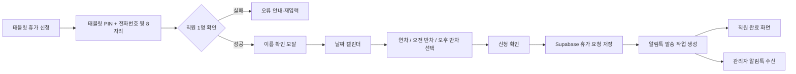

# 태블릿 휴가 신청·관리자 카카오 알림톡 기능 기획

## 목표

매장 태블릿의 전화번호 출퇴근 화면에서 직원이 스스로 휴가를 신청하고, 신청이 저장되면 해당 사업장 관리자에게 카카오 알림톡을 발송한다.

## 1. 태블릿 UX

### 첫 화면

태블릿 상단에 두 가지 진입 버튼을 둔다.

| 버튼 | 인증 | 목적 |
| --- | --- | --- |
| `출퇴근` | 전화번호 뒷 4자리 + 태블릿 PIN | 출근/퇴근 기록 |
| `휴가 신청` | 전화번호 뒷 **8자리** + 태블릿 PIN | 본인 확인 후 휴가 신청 |

`휴가 신청`은 동일한 뒷 4자리 중복 가능성을 줄이기 위해 전화번호 뒷 8자리로 식별한다. 화면에는 전체 전화번호를 표시·저장하지 않고, 입력 중에도 숫자만 허용한다.

### 휴가 신청 흐름



### 캘린더 규칙

- 과거 날짜는 비활성화한다.
- 연차: 시작일·종료일 선택, 일수 자동 계산.
- 오전/오후 반차: 단일 날짜만 선택, `0.5일`로 저장.
- 이미 승인된 휴가·휴무·중복 신청 날짜는 선택 불가 또는 경고한다.
- 직원 확인 모달에는 이름의 일부만 보여 준다. 예: `김*지님`.

## 2. 관리자 웹 UX

- 기존 `휴가 · 연차 관리`에 태블릿 신청 출처 배지(`태블릿 신청`)를 추가한다.
- 관리자에게는 신청 직원, 휴가 종류, 날짜, 일수, 신청 시각, 출처가 표시된다.
- 승인/반려 시 직원 앱 내 휴가 내역을 즉시 갱신한다.
- 알림톡 발송 성공/실패 상태를 관리자 상세 화면에서 확인할 수 있다.

## 3. Supabase 데이터 설계

### 확장 필드

`timefit_user_staff`

- `phone_last8 char(8)` — 태블릿 휴가 본인 확인용
- 기존 `phone_last4`는 출퇴근용으로 유지

`timefit_user_leave_requests`

- `source text` — `employee_app | tablet`
- `requested_at timestamptz`

### 신규 테이블

`timefit_user_notification_settings`

- `organization_id`
- `manager_phone_e164` — 알림톡 수신 관리자 번호, 서버에서만 사용
- `alimtalk_enabled`
- `provider`, `sender_profile_key`, `template_code`

`timefit_user_notification_logs`

- `organization_id`, `leave_request_id`, `recipient_masked`
- `channel` (`alimtalk`), `template_code`
- `status` (`queued | sent | failed`), `provider_message_id`, `error_message`
- `created_at`, `sent_at`

휴가 요청 저장과 발송 로그 `queued` 생성은 하나의 PostgreSQL RPC/트랜잭션으로 처리한다. 발송 실패가 휴가 신청 자체를 취소하지 않도록, 알림 발송은 비동기 Edge Function이 담당한다.

## 4. API 설계

### 태블릿 전용 Edge Function

`tablet-leave-request`

1. `organizationId`, 태블릿 PIN, 전화번호 뒷 8자리, 휴가 유형, 날짜를 수신한다.
2. 태블릿 활성화 여부와 PIN을 검증한다.
3. 직원의 `phone_last8`을 비교해 본인을 확인한다.
4. 날짜·중복 신청·휴가 일수 정책을 검증한다.
5. 휴가 요청과 알림 로그를 생성한다.
6. 큐 상태의 로그 ID를 알림톡 발송 함수에 전달한다.

`send-alimtalk`

- 서비스 역할 키로 알림 로그를 읽고, 공급사 API에 서명된 서버 간 요청을 보낸다.
- 성공 시 `sent`, 실패 시 `failed`와 오류 코드를 기록한다.
- 네트워크 오류에는 제한된 재시도와 중복 발송 방지 키를 적용한다.

## 5. 카카오 알림톡 연동 전략

알림톡은 일반 카카오 로그인/메시지 API가 아니라, 카카오 비즈니스의 **공식 딜러사 API**를 통해 발송한다. 사전에 카카오톡 채널(발신 프로필)과 정보성 메시지 템플릿을 등록·승인해야 한다. [카카오 알림톡 안내](https://business.kakao.com/info/infotalk/), [카카오 개발자 FAQ](https://developers.kakao.com/docs/ko/kakaotalk-message/faq)

### 승인 템플릿 초안

```text
[TimeFit] 휴가 신청 알림
#{직원명}님이 휴가를 신청했습니다.

· 종류: #{휴가종류}
· 일정: #{휴가일정}
· 신청 시각: #{신청시각}

관리자 화면에서 승인 또는 반려해 주세요.
#{관리자화면링크}
```

### 보안 원칙

- 공급사 API 키, 발신 프로필 키, 관리자 전화번호는 Supabase Edge Function Secret에만 저장한다.
- 브라우저·태블릿·Vercel 공개 환경 변수에 발송 키를 넣지 않는다.
- 알림에는 전체 전화번호나 휴가 사유를 포함하지 않는다.

## 6. 구현 순서와 완료 기준

1. 직원 전화번호 뒷 4/8자리 관리자 등록 UI 및 암호화/마스킹 정책 구현
2. 태블릿 휴가 신청 탭·직원 확인·캘린더·유형 선택 구현
3. Supabase 휴가 요청 RPC·중복 검증·알림 로그 구현
4. 관리자 휴가 목록 실시간 반영 및 신청 출처 표시
5. 알림톡 공급사·발신 프로필·템플릿 승인 완료
6. `send-alimtalk` 배포 및 발송/실패/재시도 통합 테스트

완료 기준은 태블릿 휴가 신청이 Supabase에 남고, 관리자 웹에 즉시 표시되며, 승인된 알림톡 템플릿으로 관리자에게 1회만 수신되는 것이다.
